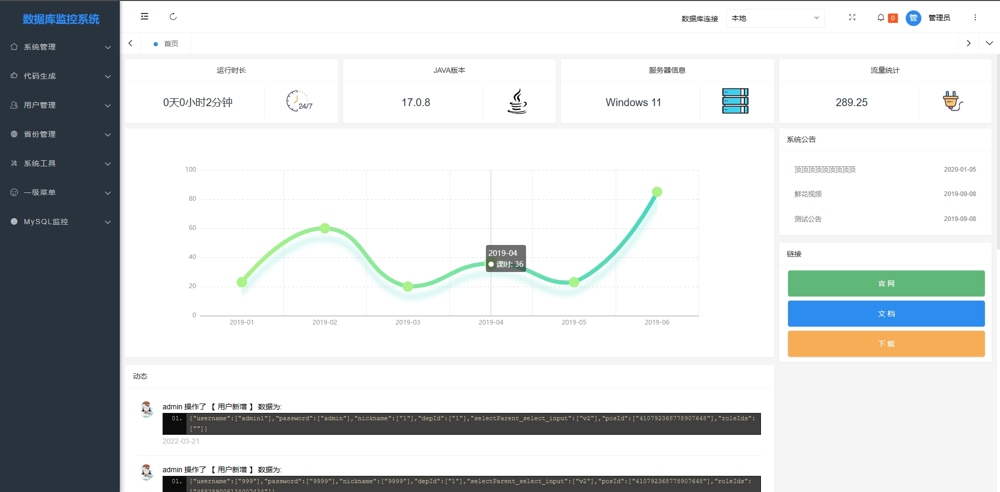
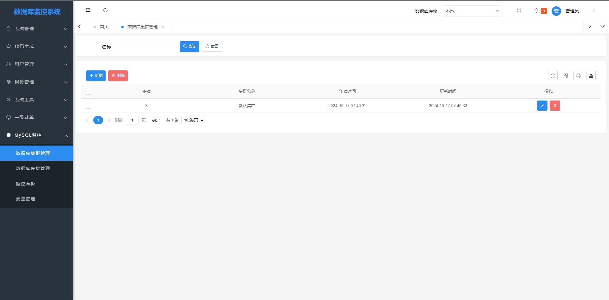
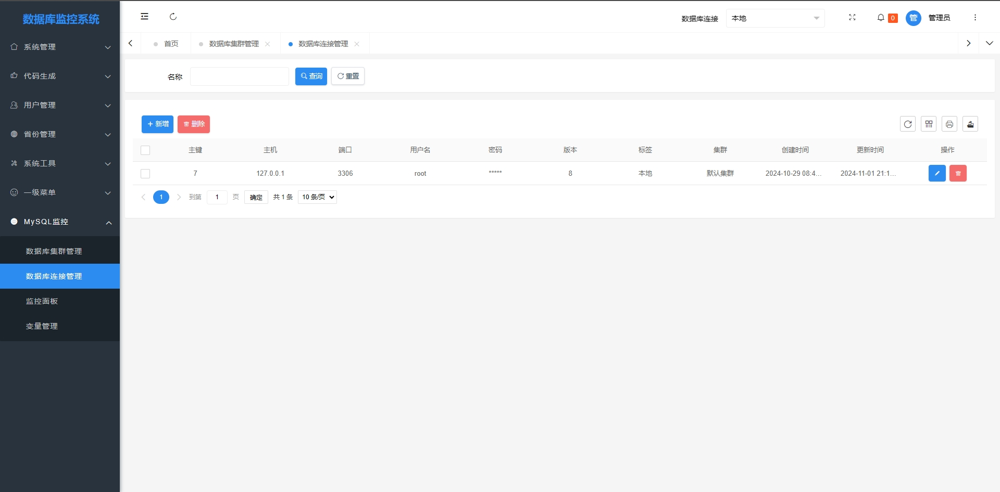
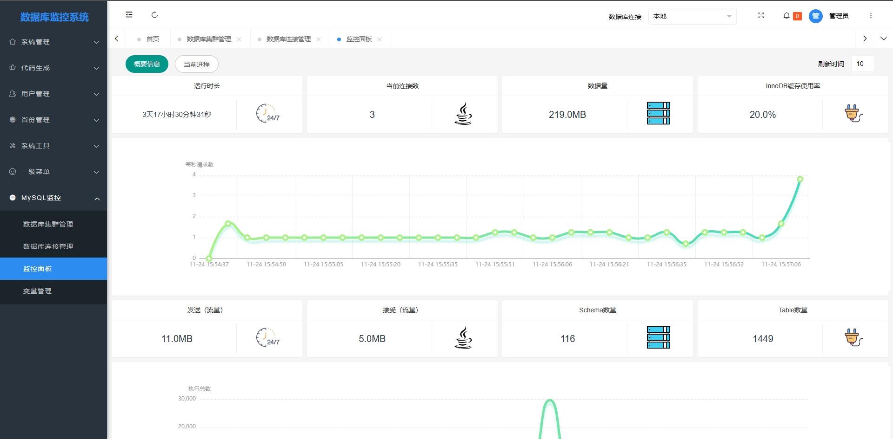
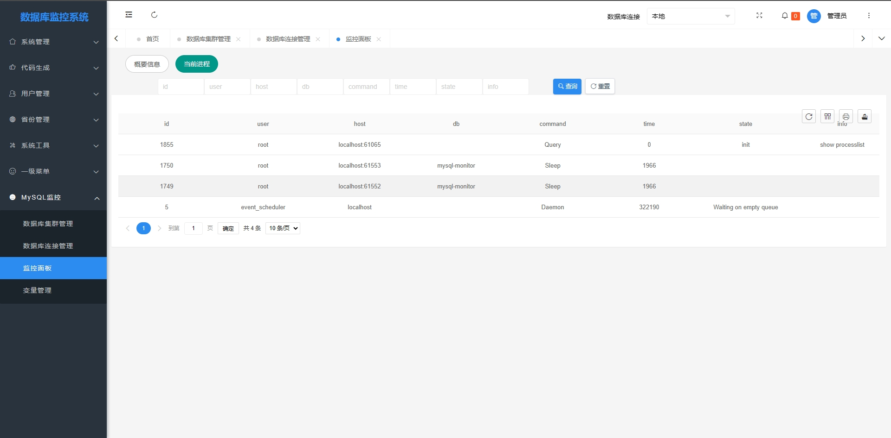
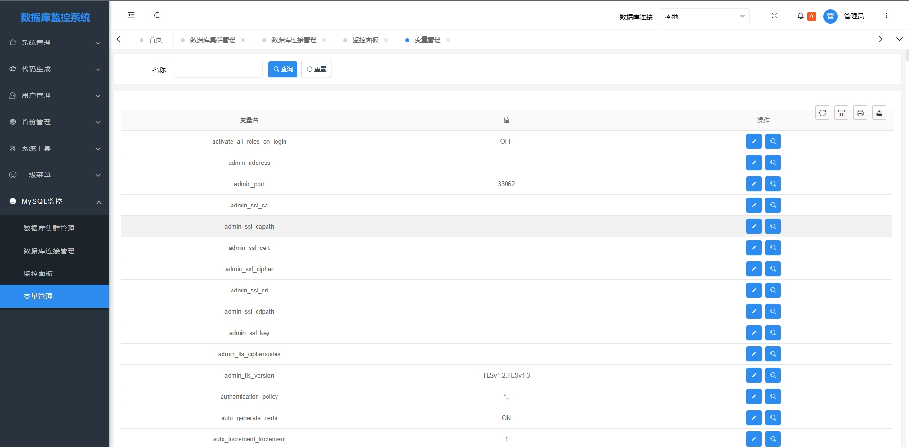
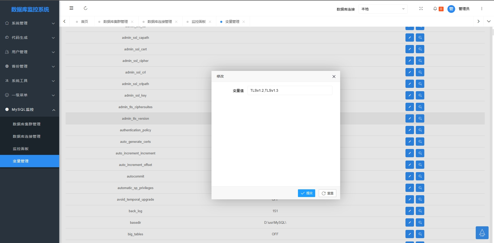
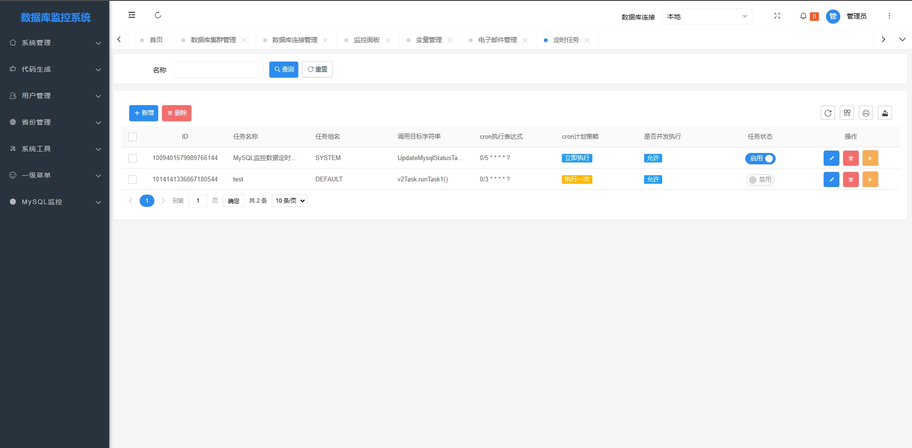
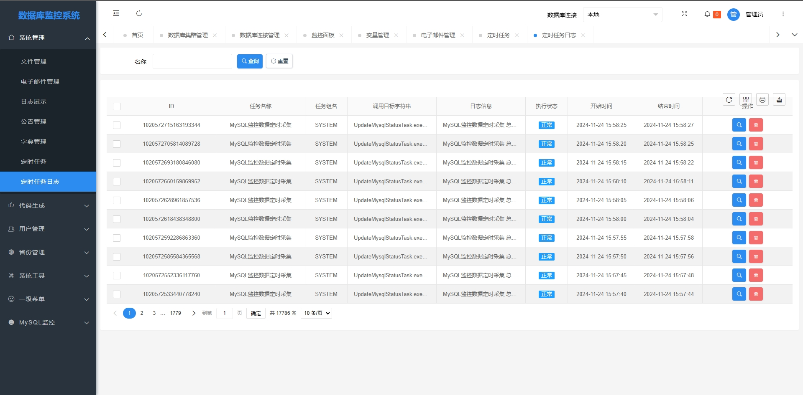

 
 

  <h1 align="center">
    MySQL监控管理系统
  </h1>
  <h4 align="center">
    基于springboot的监控管理工具，使用了springbootV2框架，同时还有多种工具类
  </h4> 

    
    
    
      
      

 

  

 

### 项目介绍

在现代软件开发和运维环境中，系统监控和管理是确保应用稳定运行、及时发现并解决问题的关键。随着微服务架构的普及，分布式系统的复杂性日益增加，传统的监控手段已难以满足需求。因此，我们开发了一款基于Spring Boot的监控管理工具，旨在提供一个全面、高效、易用的系统监控与管理解决方案。

本监控管理工具是一个集监控、告警、日志管理、性能分析等功能于一体的综合性平台。它基于Spring Boot框架构建，充分利用了Spring Boot的模块化、自动化配置和快速开发特性，使得整个系统具备高可用性、可扩展性和易维护性。

### 功能模块

- [MySQL监控]
- [状态可视化]
- [权限管理]
- [变量修改]
- [数据库优化] 开发中
- [SQL建议] 开发中
- [数据库分片]

### 项目截图

|  |  |
|---------------------|---------------------|
|  |   |
||    |
||   |
||     |
||    |

### 感谢支持

感谢每一位喜欢代码的朋友。

如果对您有帮助，您可以点击右上角 star 支持